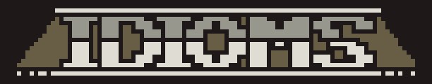
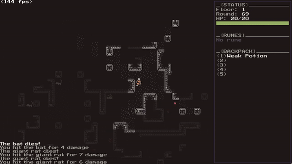

<div align="center">
      
    <h1>Idioms</h1>

<a aria-label="License" href="LICENSE">
    
</a>
</div>

*Idioms* is this little traditional rogue-like project I started a while ago just to mess around with *Rust*. It was a cool 
experience, but I never really got to finishing it. The game libraries I was using were kinda iffy at the time, 
so I switched gears and started porting it to *C*, using *SDL2*, instead. It's still a very early work in progress, 
and I'm taking it one step at a time, whenever I find the will and the time to devote to it.



## Getting Started

I wouldn't bother with this project if you're looking for a game to play. It's not even close to being playable.
But if you're interested in the code, or if you're looking for a project to mess around with, then by all means,
go ahead and clone it.

Make sure you have `CMake>=3.23`. Building has been tested on *Windows* with `MSVC` and `Mingw`. 
It should work on other OS as well, as long as SDL is supported, but I haven't tested it yet, and it may require some
tweaking.

```bash
$ git clone https://github.com/yanek/idioms.git
$ cd idioms
$ cmake -S . -B build
$ cmake --build build
```

You might also need to manually copy the assets to the build directory:
```bash
$ cp -r res build/src
```
